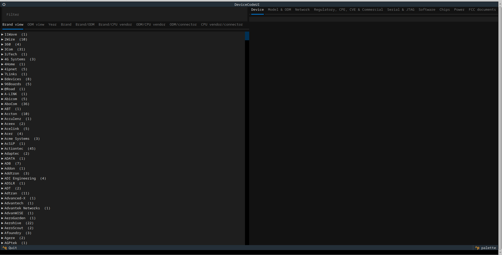
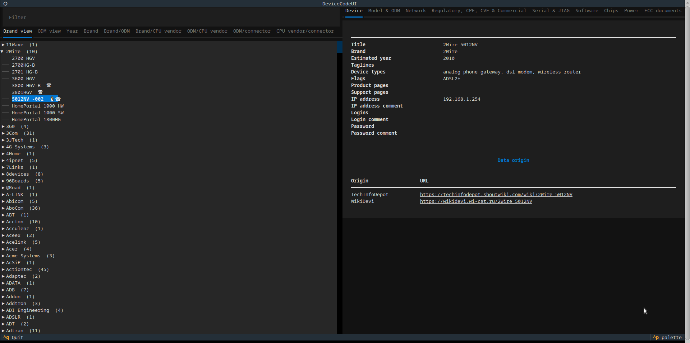
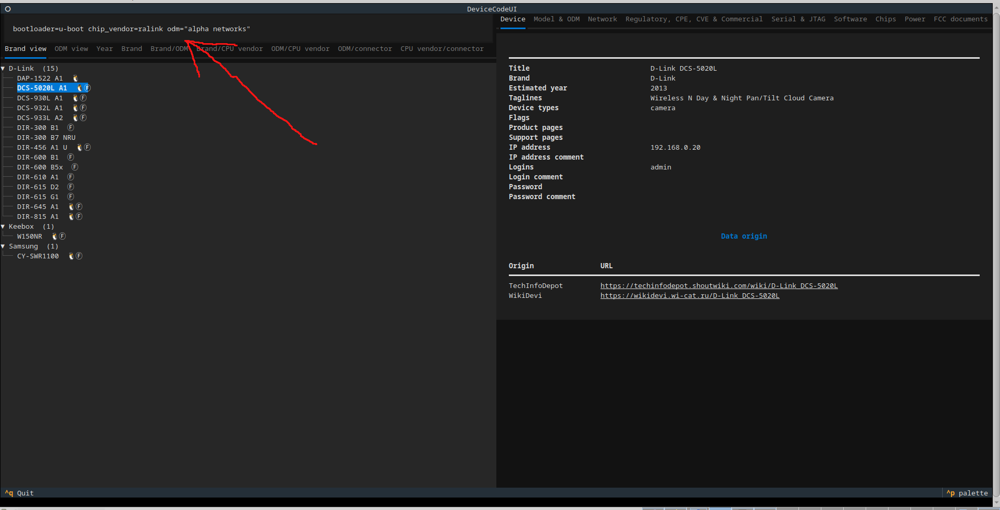

# DeviceCode Text User Interface

To quickly browse devices it is more efficient to use a specialized interface
instead of relying on tools such as `grep` and `less` to look at raw JSON
output.

A TUI (text user interface) can be a quick and easy way to browse and search
results. [Textual][textual] and [Rich][rich] are very suited for this task.

There are two modes in the TUI:

1. navigating results via a tree
2. comparing results of two devices

## Navigating results

There are many ways results can be represented and there is no single best way
to represent these results. Depending on which element is the most important
the data should be presented in a different way.

An obvious way would be to have a tree, with brands as branches and device
models as leafs, with perhaps an additional layer for the various wiki types
that were parsed.

If a CPU or chip is the most important element, then the results could be
represented as a tree, with chip vendors at the top, chip model numbers as
subtrees, and individual devices as leafs.

If operating system is the most imporant, then the results could be sorted
by operating system. If release year is the most important, then it could be
sorted by year, and so on.

Currently there are two types of views:

1. tree view
2. table view

The tree view has two members:

1. brand view: a tree with devices sorted by brand
2. ODM view: a tree with devices sorted by ODM and then brand

The table view currently has several views:

1. brand: brands
2. brand/ODM: brand/ODM combinations
3. brand/CPU vendor: brand/CPU vendor combinations
4. ODM/CPU vendor: ODM/CPU vendor combinations
5. ODM/connector: ODM/connector combinations (serial/JTAG)
6. CPU vendor/connector: CPU vendor/connector combinations (serial/JTAG)



By default the tree will not be expanded. The tree can be expanded by clicking
on the subtrees to reveal the devices/ODMs (depending on the view).


Whenever a device in the tree is clicked, then various results will be shown
in the data areas on the right side of the screen.



Some devices have extra icons next to the name. These indicate special
functionality, or characteristics of the device. This extra visual indication
allows a user to quickly navigate to devices of interest. Currently the
following extra icons are used:

* penguin - the device runs Linux by default
* robot - the device runs Android by default
* telephone - the device is either a (VoIP) phone, (analog) phone gateway or
  has VoIP functionality
* circled F - the device has information extracted from documents downloaded
  from FCC
* face screaming in fear - the device has a known CVE associated with it

### Filtering

The trees with devices can be searched using a special filtering language
(tables can currently not be filtered).

The result after filtering will be a tree containing just some of the entries.



For filtering a special purpose filtering language is used, which can
filter on a few attributes, such as:

* bootloader
* brand
* chipset manufacturer
* ODM
* flags
* serial port
* password
* etc.

For more information about the filtering language read the
[filtering language documentation](filter.md).

## Comparing two devices

A different mode is to compare the results of two devices side by side. For
this you need to know the of the devices (which you can get by inspecting
either the JSON file, or by using the "dump mode" in the CLI):

```
$ python devicecode_tui.py compare -d ~/git/devicecode-data/ --first="ZyXEL X-550" --second="ZyXEL X150N"
```


[rich]:https://github.com/Textualize/rich
[textual]:https://github.com/Textualize/textual
