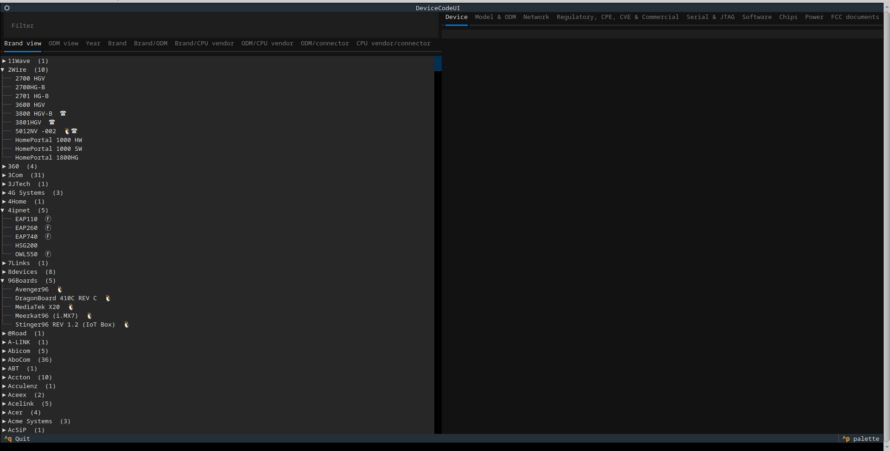

# DeviceCode Text User Interface

To quickly browse devices it is more efficient to use a specialized interface
instead of relying on tools such as `grep` and `less` to look at raw JSON
output.

A TUI (text user interface) can be a quick and easy way to browse and search
results. [Textual][textual] and [Rich][rich] are very suited for this task.

## Representing results

There are many ways results can be represented and there is no single best way
to represent these results. Depending on which element is the most important
the data should be presented in a different way.

An obvious way would be to have a tree, with brands as branches and device
models as leafs, with perhaps an additional layer for the various wiki types
that were parsed.

If a CPU or chip is the most important element, then the results could be
represented as a tree, with chip vendors at the top, chip model numbers as
subtrees, and individual devices as leafs.

If operating system is the most imporant, then the results could be sorted
by operating system. If release year is the most important, then it could be
sorted by year, and so on.

Currently there are two types views:

1. tree view
2. table view

The tree view has two members:

1. brand view: a tree with devices sorted by brand
2. ODM view: a tree with devices sorted by ODM and then brand

The table view currently has several views:

1. brand: brands
2. brand/ODM: brand/ODM combinations
3. brand/CPU vendor: brand/CPU vendor combinations
4. ODM/CPU vendor: ODM/CPU vendor combinations
5. ODM/connector: ODM/connector combinations (serial/JTAG)
6. CPU vendor/connector: CPU vendor/connector combinations (serial/JTAG)


By default the tree will not be expanded. The tree can be expanded by clicking
on the subtrees to reveal the devices/ODMs (depending on the view).



Whenever a device in the tree is clicked, then various results will be shown
in the data areas on the right side of the screen.


Some devices have extra icons next to the name. These indicate special
functionality, or characteristics of the device. This extra visual indication
allows a user to quickly navigate to devices of interest. Currently the
following extra icons are used:

* penguin - the device runs Linux by default
* robot - the device runs Android by default
* telephone - the device is either a (VoIP) phone, (analog) phone gateway or
  has VoIP functionality
* circled F - the device has information extracted from documents downloaded
  from FCC

## Filtering

The trees with devices can be searched using a special filtering language
(tables can currently not be filtered).

The result after filtering will be a tree containing just some of the entries.


For filtering a special purpose filtering language is used, which can
filter on a few attributes, such as:

* bootloader
* brand
* chipset manufacturer
* ODM
* flags
* serial port
* password
* etc.

### Filtering language

The filtering language is fairly simplewith statements and (implicit)
operators (for combining results).

#### Statements

Statements resemble bash shell commands and exports and are of the form:

```
name=value
```

In the future this will be extended to allow extra parameters (which will be
different for each field):

```
name?params=value
```

The format of `params` has not been defined yet.

`name` can be one of:

* `baud`
* `bootloader`
* `brand`
* `chip`
* `chip_type`
* `chip_vendor`
* `connector`
* `cve`
* `cveid`
* `fccid`
* `file`
* `flag`
* `ignore_brand`
* `ignore_odm`
* `ignore_origin`
* `ip`
* `jtag`
* `odm`
* `origin`
* `os`
* `package`
* `partition`
* `password`
* `program`
* `rootfs`
* `sdk`
* `serial`
* `type`
* `year`

Both names and values are case insensitive.

A name can appear multiple times. Multiple instances with the same name should
be interpreted as "OR". Instances with a different name should be interpreted
as "AND". As an example:

```
odm=edimax odm=accton
```

should be read as:

```
odm=edimax OR odm=accton
```

and return results where either of those two values is true.

```
odm=edimax brand=asus
```

should be read as:

```
odm=edimax AND brand=asus
```

Combining the two:

```
odm=edimax odm=accton brand=asus
```

should be read as:

```
(odm=edimax OR odm=accton) AND brand=asus
```

or even more complex combinations, such as:

```
brand=asus brand=cisco odm=arcadyan odm=edimax brand=netgear brand=sitecom chip_vendor=ralink
```

which should be read as:

```
(brand=asus OR brand=cisco OR brand=netgear OR brand=sitecom) AND (odm=arcadyan OR odm=edimax) AND chip_vendor=ralink
```

In case there are special characters or spaces, then these can be quoted, for
example:

```
brand="Banana Pi"
```

##### Baud rate

`baud` can be used to filter on the baud rate of the serial port (if present).

##### Bootloader

`bootloader` can be used to filter on bootloader.

##### Brand

There are two ways to filter brands:

1. use the `brand` statement to show devices from one or more brands
2. use the `ignore_brand` statement to hide devices from one or more brands

##### Chip type

Currently `chip_type` can only be used to show the type of the main CPU in one
or more devices.

##### Chip vendor

Currently `chip_vendor` can only be used to show the main CPU in one or more
devices.

##### Connector

`connector` can be used to filter connectors (serial port only for now, JTAG
in the future as well).

##### CVE

`cve` can be used to show devices that have, or don't have, an associated CVE.
Valid values are `yes` and `no`.

##### CVE id

`cveid` can be used to show devices associated with a certain CVE identifier.

##### FCC id

`fccid` can be used to show devices associated with a certain FCC identifier.

##### File

`file` can be used to show devices with certain files.

##### Flag

`flag` can be used to show devices with certain flags.

##### IP

`ip` can be used to show devices using a certain default IP address (for
example `192.168.1.1`).

##### ODM

There are two ways to filter ODMs:

1. use the `odm` statement to show devices made by one or more ODMs
2. use the `ignore_odm` statement to hide devices made by one or more ODMs

##### Default operating system

`os` can be used to show the default operating system that is installed on
the device.

##### Origin

There are two ways to filter origins (OpenWrt, TechInfoDepot, WikiDevi)::

1. use the `origin` statement to show devices for which there is information
   defined in that specific wiki
2. use the `ignore_origin` statement to hide devices for which there is
   information defined in that specific wiki

For example, to show devices that are in OpenWrt, but not in WikiDevi use:

`origin=openwrt ignore_origin=wikidevi`

##### Serial

`serial` can be used to show if a device has a serial port, or if it is not
known. Valid values are `yes`, `no` and `unknown`.

##### JTAG

`jtag` can be used to show if a device has a JTAG port, or if it is not
known. Valid values are `yes`, `no` and `unknown`.

##### Package

`package` can be used to show devices containing the package. Package
information is currently extracted from parsing boot logs.

##### Partition

`partition` can be used to show devices where the Linux kernel commandline
has certain name for a partition (for example: `u-boot-env` or `nvram`).

##### Password

Currently `password` can only be used to show devices with one or more default
passwords.

##### Program

`program` can be used to show devices containing specific program names as
extracted from output of the `ps` command.

##### root file system type

`rootfs` can be used to show devices where the Linux kernel has support for
having the root file system on a certain file system type (such as `squashfs`
or `jffs2`).

##### SDK

`sdk` can be used to show devices with references to a certain SDK, such as
`LSDK` (Atheros and Qualcomm Atheros).

##### Year

`year` can be used to show devices that have a year associated with it. This
year is either one of:

* release date
* FCC date
* WiFi certified date

The year can either be a single year:

```
year=2018
```

or it can be a range (inclusive):

```
year=2018:2020
```

which is equivalent to:

```
year=2018 year=2019 year=2020
```

[rich]:https://github.com/Textualize/rich
[textual]:https://github.com/Textualize/textual
